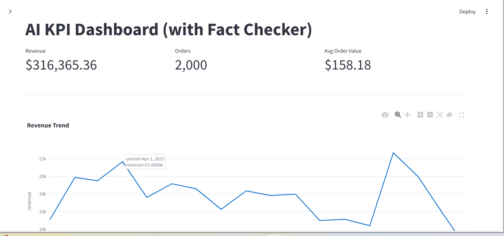

# AI-Powered Business Insights Dashboard (with Fact Checker)

Small, Streamlit app that analyzes a retail-style dataset, shows KPIs, and generates **AI insights** that are **fact-checked** against the data.

## Quick Start

```bash
make setup
make data
make run
```

This launches Streamlit on a local URL. The default dataset is a small synthetic sample generated locally (no internet required).

## Notes
- The default LLM adapter ships with an offline heuristic so the app works without keys.
- To use a hosted model, set env `USE_OPENAI=1` and `OPENAI_API_KEY` (adapter stub included).

## Data
This app uses the **Online Retail II** dataset (UCI ML Repository, CC BY 4.0).  
Raw file is kept locally (`data/raw/`); processed Parquet lives in `data/processed/`.

## Evaluation
We log each run (payload, model settings, raw JSON output, and checks) and summarize results.
See **artifacts/eval_summary.csv** for VERIFIED% across runs.

## Screenshot


## Executive summary (offline by default)

This build runs the Executive summary using an offline heuristic (no external API calls).

**Enable a hosted model later (optional):**

1) Install the client:
